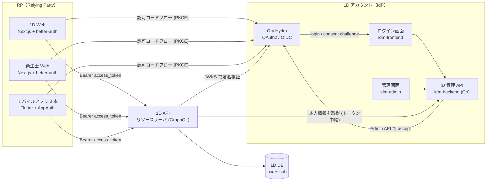
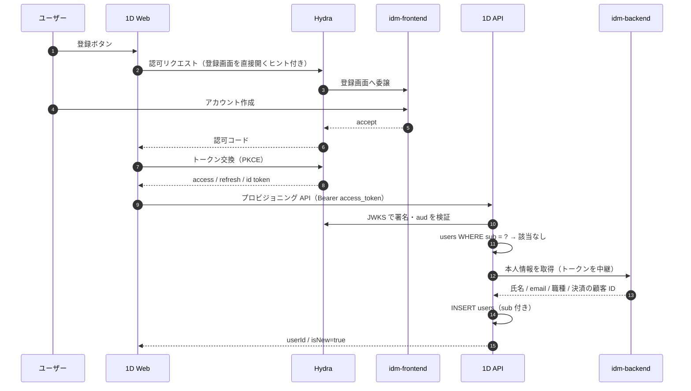

こんにちわ。ワンディー株式会社の Software Engineer をしております上村です。

歯科医療プラットフォーム [1D](https://oned.jp/) は、動画で歯科医療技術が学べるサブスクリプションサービスとして始まりましたが、現在は歯科医師向けの 1D Web / 1D アプリに加えて、歯科衛生士向けのアプリと Web、国家試験対策アプリなど、複数のプロダクトを展開するようになりました。

プロダクトが増えると必ず問題になるのが「アカウント」です。今回、1D 全プロダクトで共通に使う認証基盤、いわゆる IdP（Identity Provider。社内では **1D アカウント** と呼んでいます）を Ory Hydra ベースで自前構築し、稼働中のサービスを OIDC の Relying Party（RP）へ切り替えました。この記事では、なぜマネージドサービスではなく自前で作ったのか、どういう構成にしたのか、既存ユーザーを抱えたまま認証方式をどう切り替えたのか、そして実装で踏んだ落とし穴をまとめて紹介します。

# TL;DR

- 共通 IdP は **Ory Hydra（OAuth2 / OIDC サーバ）+ 自前の ID 管理サービス（Go）+ 自前のログイン画面（React Router）** で構成した
- 当初は Amazon Cognito を提案していたが、ログイン画面の自由度と既存ユーザー移行の制御性を理由に自前構築へ方針転換した
- 既存ユーザーは、ユーザー DB を IdP 側へ複製したうえで、各プロダクト側のユーザーを初回ログイン時に自動で紐付ける方式で移行した。バックエンドは移行期間だけ新旧トークンの両受けにした
- カットオーバー（本番環境を旧方式から新方式へ切り替える作業）は深夜のメンテナンスと **モバイルアプリの強制アップデート** を組み合わせて 1 回で通し、PoC 着手から旧方式の撤去まで約 4 ヶ月だった
- RP 実装では Next.js の `<Link>` prefetch と better-auth の `nextCookies()` が認証の副作用やリクエスト数に影響するので注意

# なぜ共通認証基盤が必要だったのか

1D のバックエンドは Laravel から Go へリプレイスを進めてきました（[以前の記事](https://zenn.dev/oned_tech/articles/oned-tech-select)）。認証も Laravel Passport 由来の自前署名 JWT を Go 側で検証し続ける形で引き継いでいましたが、この仕組みには 4 つの限界がありました。

1. **プロダクトをまたいだ SSO ができない。** 1D Web で作ったアカウントで衛生士向けアプリにログインする、という体験が素直に作れない
2. **ユーザー ID が製品ごとにばらける。** 新プロダクトごとに users テーブルが増えると、同一人物の突合が運用の仕事になる
3. **認証まわりの実装が重複する。** パスワード再設定やメール検証を製品ごとに書くのは、セキュリティ対応の面でも無駄が多い
4. **契約や決済がプロダクト単位に閉じる。** 事業としては、一人のユーザーが複数プロダクトを横断して使う前提でプランや契約を設計したい。そのためには「誰が」を一つのアカウントで表し、決済情報もそこに紐づいている必要がある

事業側の要求としては 4 が一番大きく、エンジニアリング側の要求としては 1〜3 が大きい、という関係です。「認証は一箇所に寄せ、各プロダクトは OIDC の RP として振る舞う」という方向は早い段階で決まりました。問題は **何を IdP にするか** でした。

# 技術選定: Cognito をやめて Hydra + 自前 IDM にした

弊社では技術的な意思決定を ADR（Architecture Decision Record）として残しています。実はこの認証基盤には ADR が 2 本あります。最初に起こした ADR では **Amazon Cognito** を採用する方針でした。マネージドで運用負荷が低く、AWS に寄せている弊社のインフラとも相性が良いからです。

しかし設計を詰めるうちに、2 つの課題が見えてきました。

- **ログイン・会員登録の導線は事業側と細かく改善し続ける前提があった。** 流入経路ごとの文言変更、登録ステップ表示、キャンペーン導線などが見込まれ、Hosted UI では応えきれない。SDK で画面を自前実装することも可能だが、そうすると認証フローの制御を Cognito 側の仕組みに合わせ続けることになり、マネージドに任せる利点が薄れる
- **既存ユーザーの移行を自分たちの手順で制御したい。** パスワードハッシュ、属性、決済の顧客 ID を持つ既存ユーザーを、マネージド側が用意した移行経路に乗せるのではなく、検証手順と切り戻しを自分たちで設計できる形で移したかった

そこで Cognito 案の ADR を Superseded（置き換え済み）にして新しい ADR を起こし、**Ory Hydra + 自前 IDM（Identity Management。ユーザー管理サービス）** の構成に方針転換しました。

## なぜ Hydra か

Ory Hydra は OAuth2 / OpenID Connect の認可サーバに **特化した** OSS です。特徴的なのは、Hydra 自身がユーザー DB やログイン画面を一切持たないことです。ログインが必要になると Hydra は `login_challenge` を付けて外部のログイン画面へリダイレクトし、認証が済んだらアプリ側から Admin API 経由で「このユーザーで accept」と返してもらう、という設計になっています。

この割り切りが弊社の要件にぴったりでした。

- OAuth2 / OIDC のプロトコル実装（トークン発行、JWKS 公開、PKCE、リフレッシュトークンのローテーション）は Hydra に任せる
- ユーザーのデータモデル、ログイン・登録画面、パスワードポリシーはすべて自前で持つ

「プロトコル = Hydra」「ID 管理と画面 = 自前」という責務境界が明確になります。

## なぜ Kratos ではないのか

Ory には ID 管理まで担う **Ory Kratos** もあり、「Ory 一式」で組む選択肢も検討しました。却下した軸は Cognito のときと同じで、**ID のデータモデルと登録・ログインのフローを自分たちで持ちたかった** からです。

- **データモデル。** Kratos はユーザー属性（traits）を JSON で保持します。後述するように既存ユーザーの移行では、移行期間中に既存 DB からテーブル単位で同期し続ける方式を想定していたので、同期先のスキーマを自分たちで握っている必要がありました
- **パスワードポリシー。** Kratos のパスワードポリシーは調整できる範囲が限られ、独自ルールを差し込む拡張点がありません。既存パスワードでのログイン自体はハッシュをインポートすればできますが、既存ユーザーがパスワードを変更・再設定した瞬間にルールが変わる体験になり、既存ユーザーの体験を変えないという今回の方針と合いませんでした
- **フロー。** 登録・ログイン・パスワード再設定は Kratos の self-service flow の状態遷移に沿って画面を組むことになります。事業側と導線を細かく改善し続ける前提では、この制約は Cognito の Hosted UI と同種の問題になります

代わりに、Kratos なら標準で備わるパスワードポリシーやアカウント復旧などの機能は自前で持つことになります。ここは Hydra に委譲できる範囲（プロトコル）と自前で持つ範囲（データとフロー）の線をどこに引くか、という判断でした。

## トレードオフ

自前構築の代償は当然あります。IdP の可用性、セキュリティパッチ、監視はすべて自分たちの責任になりますし、Cognito であれば設定で有効化できる機能も、自分たちでログイン画面と ID 管理側に載せていくことになります。それでも「ログイン体験を自由に作れること」と「ユーザーデータを自分たちの手元に置くこと」の価値が上回ると判断しました。

# 全体アーキテクチャ



設計上の原則は 3 つです。

- **認証（Authentication）は IdP に集約し、認可（Authorization）は各プロダクトに残す。** 「この人が誰か」は共通だが、「この人に何ができるか」はプロダクトのドメイン知識なので中央集権にしない
- **ユーザーの不変 ID は IdP 側 users の主キー**で、アクセストークンの `sub` クレームとして各プロダクトに渡す
- **各プロダクト側のユーザーは初回ログイン時に JIT（Just-In-Time）で作る。** IdP にアカウントができた時点では各プロダクトには何も起きず、そのトークンで初めてアクセスが来たときにプロダクト側の users 行が生える

## 各コンポーネントの技術スタック

| コンポーネント               | 役割                                                                                                 | 技術                                            |
| ---------------------------- | ---------------------------------------------------------------------------------------------------- | ----------------------------------------------- |
| Hydra                        | 認可コード発行・トークン発行・JWKS 公開・ログインセッション（OP = OpenID Provider のセッション）管理 | Ory Hydra（MySQL）                              |
| idm-backend（ID 管理 API）   | login / consent / logout challenge の処理、ユーザー CRUD、クレーム組み立て                           | Go、connect-rpc、ent、クリーンアーキテクチャ    |
| idm-frontend（ログイン画面） | ログイン・会員登録・パスワード再設定の画面                                                           | React Router v7（SSR）、connect-rpc             |
| idm-admin（管理画面）        | ユーザー管理画面                                                                                     | Next.js、社内アカウントでのログイン             |
| RP（Web）                    | OIDC クライアント、RP セッション管理                                                                 | Next.js、better-auth の genericOAuth プラグイン |
| RP（アプリ）                 | OIDC クライアント                                                                                    | Flutter、flutter_appauth                        |
| 1D API（リソースサーバ）     | アクセストークン検証、JIT プロビジョニング                                                           | Go、go-oidc                                     |
| インフラ                     | IdP 3 サービスのホスティング                                                                         | ECS Fargate、ALB、RDS、Terraform                |

idm-backend は 1D 本体の API と同じくクリーンアーキテクチャで組んでおり、Hydra の Admin API 呼び出しはインターフェースの裏に隠しています。ユースケースから見ると「ログイン challenge を accept する」という操作があるだけで、Hydra の SDK には依存しません。RPC は connect-rpc で、ログイン画面からも 1D API からも同じ protobuf 定義で呼べるようにしています。

Hydra に登録する OAuth2 クライアント定義は JSON ファイルを source of truth にして宣言的に同期し、PKCE は全クライアントに強制しています。また、ログインの accept など強い操作ができる Hydra の Admin API は外部に公開せず、idm-backend からの内部通信だけが到達できる構成にしています。

# PoC から本実装まで

いきなり本実装に入らず、まず検証用の小さなリポジトリで **PoC** を作りました。docker compose で Hydra、最小限の ID 管理 API、ログイン画面、そして「1D のふりをする RP」を立てて、認可コードフローが端から端まで通ることと、Hydra の login / consent challenge の手触りを確かめるのが目的です。「Hydra は画面もユーザー DB も持たない」という設計が実際にどういう実装量になるのかを体感できたことで、ADR の方針転換に自信が持てました。Cognito 案の ADR は Proposed のままだったので、PoC の結果を受けて Hydra 案で進めることにし、新しい ADR を起こしてレビューを経て Accepted にしています。

時系列はこうです。

| 時期     | できごと                                                          |
| -------- | ----------------------------------------------------------------- |
| 5 月     | PoC。結果を受けて Hydra 案で本実装を開始（ADR 文書の更新は 7 月） |
| 7 月上旬 | Hydra + 自前 IDM の ADR を起こし、レビューを経て Accepted         |
| 8 月上旬 | 1D API に OIDC 検証を導入                                         |
| 8 月中旬 | カットオーバー                                                    |
| 8 月末   | 旧署名鍵をローテートし旧トークンを一斉失効                        |
| 9 月上旬 | デュアル認証を撤去し、OIDC 専用化                                 |

# 既存ユーザーを抱えたまま認証方式を切り替える

ここからが本題です。新規サービスに OIDC を組み込むのは難しくありませんが、**すでに多くのユーザーが日々ログインしているサービス** を、無理なく新しい IdP に乗せ換えるにはいくつもの仕掛けが必要でした。

## 1. 既存ユーザーを DMS で IdP 側へ複製する

まず、1D の users テーブルを **AWS DMS（Database Migration Service）で IdP 側の users テーブルへ複製** しました。ポイントは、**主キーの id をそのまま保持して複製した** ことです。これにより、既存ユーザーについては「1D 側の users.id = IdP 側の users.id = トークンの `sub`」という関係が最初から成立します。

DMS は初期ロードだけでなく CDC（変更データキャプチャ）も有効にして、旧経路での書き込みが止まるまでの間、1D 側で起きたプロフィール更新や新規登録を IdP 側へ流し続けました。移行期間中は旧経路での書き込みが続くので、この同期が無いと IdP 側のデータが古くなります。こうした移行期間限定の仕掛けには、入れる時点で撤去条件をコードのコメントに書くようにしています。

## 2. `users.sub` をバックフィルする

1D 側の users テーブルには、IdP の `sub` を保持する nullable なカラムを追加しました。上で書いたとおり既存ユーザーは id と `sub` が一致するので、バックフィルは次の 1 文で済みます。

```sql
UPDATE users SET sub = id WHERE sub IS NULL;
```

`WHERE sub IS NULL` を外してはいけないのがこの移行の肝です。移行期間中に IdP 経由で新規登録したユーザーは JIT で 1D 側に行が作られますが、その行の id は 1D 側の採番、`sub` は IdP 側の採番なので一致しません。無条件で `sub = id` を流すと、その人の `sub` を別人の IdP アカウントに書き換えてしまいます。実際、アプリ審査中に審査員が新規登録を完走するとこの行ができ得るので、実行前に id と `sub` が一致しない行を SELECT で数え、移行期間中に JIT で作られた行が想定どおりの件数であることを確認してから流す手順にしました。

バックフィルは 3 回に分けて流しました。審査提出前に全ユーザー分、カットオーバー当日のメンテナンス中にそれ以降の差分、強制アップデート後に旧経路の書き込みが止まったのを確認してから最後の取りこぼし分、という順序です。冪等なので何度流しても害がなく、DMS の停止はこの 3 回目の後に行いました。

## 3. JIT プロビジョニングの設計

RP 側に「会員登録」という API はもう存在しません。IdP でアカウントが作られ、そのトークンで初めて 1D API に来たときに 1D 側のユーザーが生えます。



設計上こだわった点は 2 つあります。

- **JIT の経路は 1 本に絞らない。** コールバック直後の明示的なプロビジョニング API に加えて、本人情報を取得する通常のクエリでも未紐付けなら自己修復するようにしています。コールバックで失敗しても次の画面で復旧するので、ユーザーから見た「ログインしたのに会員になっていない」状態が残りません
- **JIT を行う API だけは「会員であること」を要求しない。** 1D API のほとんどの API には「ログイン済みの会員であること」を要求するガードがかかっています。このガードは「トークンが正しいこと」と「1D 側の users テーブルにその人の行があること」の両方を見ます。ところが初回ログインの瞬間は、トークンは正しいのに users 行がまだありません。行を作るのが JIT の仕事だからです。ここに同じガードをかけると「行が無いから弾かれ、弾かれるから行を作れない」という循環になるので、JIT を行う API だけは「users 行の存在」の条件を外しています。署名・発行者・`aud`・有効期限といったトークン自体の検証は、他の API と同じミドルウェアで行っています

## 4. デュアル認証ミドルウェア: モバイルアプリ審査のための時間差

Web だけならデプロイと同時に切り替えられますが、モバイルアプリには **審査** があります。審査に出すバイナリはリリースするバイナリそのものなので、審査の時点で本番バックエンドが新しい OIDC トークンを受け付けている必要がありました。

そこで 1D API の認証ミドルウェアを、トークンの `iss` クレームが自社 IdP なら OIDC として、それ以外は旧方式として検証する **デュアル認証** にしてバックエンドだけ先行リリースしました。これで審査中のアプリは新方式で動作確認でき、既存ユーザーは旧トークンで使い続けられます。

## 5. カットオーバー当日

モバイルアプリ 3 本が「審査承認済み・手動公開待機」に揃ったのを確認してから、深夜にカットオーバーを行いました。手順は次の通りです。

1. Web / アプリ全面をメンテナンスモードに
2. 旧経路の会員登録を無効化
3. Web を新認証へ切り替え、スモークテスト後に Web のメンテナンスを解除
4. モバイルアプリをストア公開し、本番でスモークテスト
5. **強制アップデート** を発動
6. アプリのメンテナンスを解除

強制アップデートを発動した時点が **ポイント・オブ・ノーリターン** です。事前にリリース手順書をフェーズ分けし、工程ごとに「戻れるか、どう戻すか」を表にしておきました。

| 工程               | 戻せるか             | 戻し方                                                                                                       |
| ------------------ | -------------------- | ------------------------------------------------------------------------------------------------------------ |
| Web の切替         | 即時                 | Vercel のロールバック、またはメンテナンス再開。完全撤退できる                                                |
| sub のバックフィル | 不要                 | WHERE 付きで冪等。戻す概念がない                                                                             |
| アプリのストア公開 | 公開自体は取消不可   | ただしバックエンドがデュアル認証のままなので、旧版アプリは無傷。「公開したが移行中止」の中間状態で耐えられる |
| 強制アップデート   | フラグは数分で戻せる | 救えるのは未更新者だけ。新版に上げた人はダウングレードできない                                               |

NO-GO になった場合の退避形も決めてありました。Web はステージングで実証済みなので新認証のまま残し、アプリは強制アップデートを発動せず旧版をデュアル認証で生かしたまま原因を潰して再挑戦する、という形です。GO 条件は「ストア反映の確認」と「本番でのログイン・視聴・課金導線のスモークテスト通過」の 2 つに絞り、夜間発動なので翌朝の初動確認を必須工程にしました。

もう一つ、審査期間中に **IdP の登録画面を閉じなかった** のも意識的な判断です。閉じておけば移行期間中に JIT で作られる行はできませんが、審査員が登録を完走できずリジェクトされるリスクがあります。閉塞せず、副作用はバックフィル SQL の WHERE 句と事前の件数確認で吸収する方を選びました。

結果として、当日は手順をなぞるだけで済みました。

## 6. 旧トークンの強制失効と、デュアル認証の撤去

カットオーバー後は、旧トークンでのアクセスがどれだけ残っているかをログで計測する期間を置きました。ただ、旧トークンの自然失効を待つと移行期間が数ヶ月単位で延びるため、能動的に失効させることにしました。

そこで **旧署名鍵をローテート** しました。鍵ペアを差し替えて 1D API を再デプロイすることで、ローテート前に発行された旧トークンは有効期限に関わらず一斉に検証不能になります。更新前のアプリを使い続けていた方はこの時点でアプリの更新と再ログインが必要になるため、切替前のメール告知に加え、ログで残存利用が十分小さいことを確認したうえで実施しました。

旧経路での認証成功が枯れたことを確認してから、デュアル認証ミドルウェアを撤去し、1D API のユーザー認証は HTTP / WebSocket とも **OIDC 専用** になりました。

## 7. ユーザーから見た変化

ここまで裏側の話ばかりでしたが、ユーザーから見た変化は最小限に抑えています。

- **パスワードの再設定は不要。** 旧基盤と同じハッシュ方式を採用し、パスワードハッシュをそのまま IdP 側へ複製したので、既存のメールアドレスとパスワードでそのままログインできます。旧基盤と新基盤でハッシュ形式が変わる移行であれば、ログイン成功時に新形式で再ハッシュする仕組みが別途必要になるところでした
- **Web は 1 回だけ再ログイン。** カットオーバー後の初回アクセスで新しいログイン画面に案内され、以降は SSO が効きます
- **アプリは更新後に 1 回ログイン。** 強制アップデートで新版に上がった後、初回だけログインが必要です

# 実装で踏んだ落とし穴

ここからは実装で実際に踏んだ問題を、原因と対処とセットで挙げます。OIDC を「RP として組み込む」側の情報は意外と少ないので、同じことをやる方の参考になれば幸いです。

## Next.js の `<Link>` prefetch で認証の副作用が発火する

Web の RP には TypeScript 製の認証ライブラリ better-auth を使っています。1D Web では `/login` や `/register` を画面ではなく **302 を返すだけの Route Handler** にしています（画面は IdP 側にあるため）。ここで問題になったのが Next.js の prefetch です。`<Link>` はビューポートに入っただけで遷移先を prefetch しますが、遷移先が Route Handler だとその GET が **サーバーで実際に実行されます**。結果、ユーザーがクリックする前に OAuth の state Cookie が発行されたり、登録導線の状態を保持する Cookie が立ったりしました。

`prefetch={false}` で prefetch 自体は止まりますが、それでも `<Link>` のクリック時のナビゲーションは別オリジン（IdP）へのリダイレクトを追えず、コンソールエラーになります。認証入口はフルページナビゲーションにする必要があるので、認証入口のパスを許可リストで管理し、リンク用コンポーネントはそのパスに対して `<Link>` ではなく素の `<a>` を選ぶようにしています。

## better-auth の `nextCookies()` でリクエストが数倍に

カットオーバー直後、1D API へのリクエストと Vercel の Function 呼び出しが数倍に跳ね上がりました。原因は better-auth の Next.js 連携用プラグイン `nextCookies()` でした。このプラグインは better-auth が Set-Cookie を返したときに Server Action の中で `cookies().set()` を呼ぶのですが、Next.js はこれを「サーバー側で状態が変わった」と解釈して RSC の再描画と prefetch キャッシュの全消去を行います。当時はブラウザからのアクセストークン取得を Server Action 経由で行っており、セッション Cookie の期限延長などで Set-Cookie が返るたびにこの連鎖が GraphQL operation の数だけ起きて乗算になっていました。

`nextCookies()` を外し、Set-Cookie が必要な箇所（OAuth の state Cookie、ログアウト時のセッション破棄）だけ、Route Handler の中で better-auth のレスポンスヘッダを明示的に転写する形に変えて解決しました。

# 今後

認証基盤としての土台はできましたが、やり残しもあります。

- **ログイン時の属性同期。** IdP 側でプロフィールを変更したとき、各プロダクト側のキャッシュへ反映する経路を作る
- **認証手段の拡張。** 多要素認証やソーシャルログインは、ログイン画面と ID 管理を自前で持っているので IdP 側に閉じて追加できる

# おわりに

認証基盤の移行は「動いているものを、ユーザーの手をできるだけ煩わせずに、別の仕組みに載せ換える」仕事で、新機能開発とは違う種類の緊張感があります。今回うまくいった要因を挙げるなら、PoC で手触りを確かめてから ADR を書き直したこと、デュアル認証でアプリ審査と切替のタイミングを切り離したこと、そしてカットオーバーの「戻れない地点」を事前に全員で共有しておいたことだと思っています。

弊社は少人数のチームですが、こういった基盤の意思決定から実装、カットオーバーの運用まで一気通貫で関われる環境です。最後までお読みいただきありがとうございました。

# Link

1D ではメンバーを大募集中です。1D プラットフォームの開発に興味を持った方がいればぜひご応募お待ちしています。詳しくは以下のページをご覧ください。
